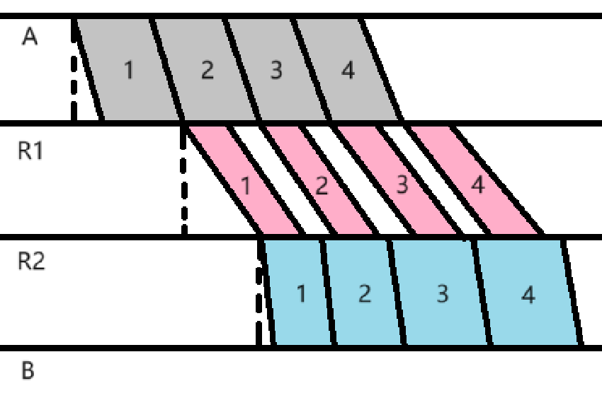
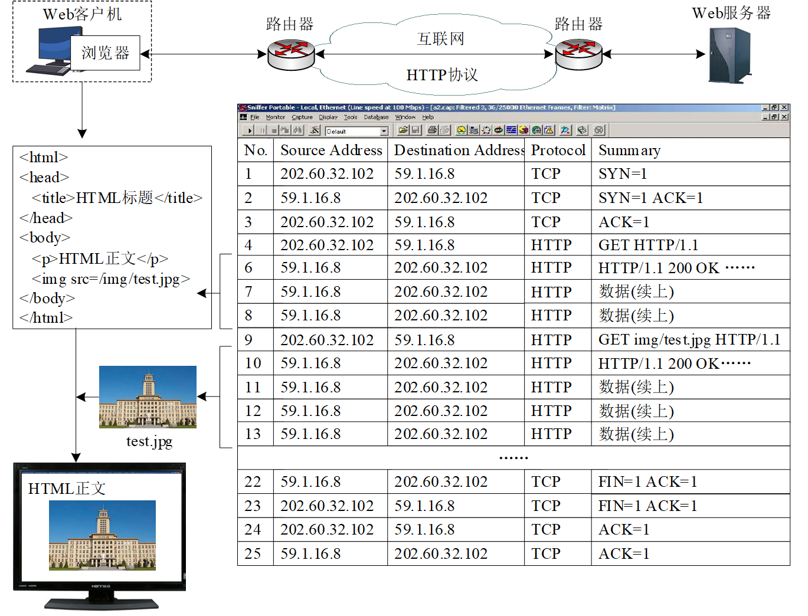
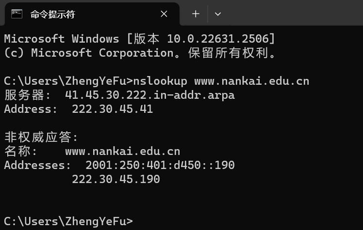
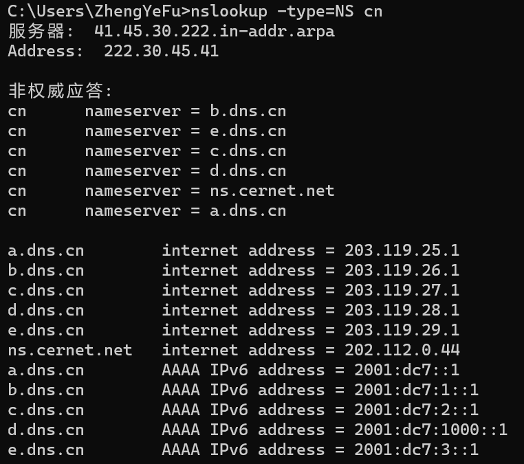
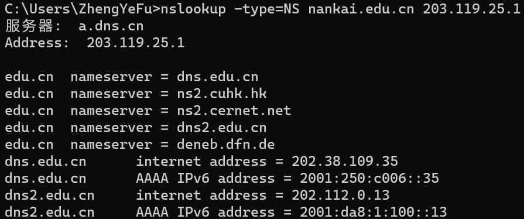
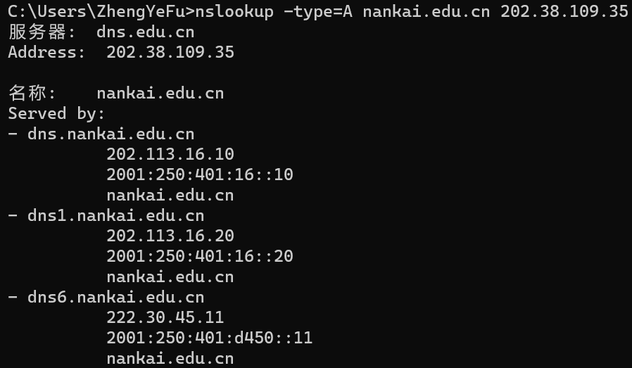
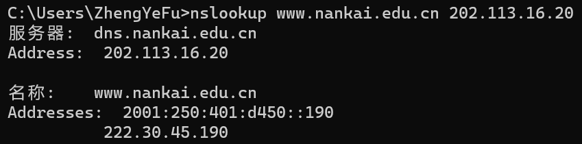

# 第1次书面作业
- 姓名：付政烨
- 学号：2113203

## 习题1（50分）
>网络结构如下图所示，主机A与主机B之间通过3段链路和2台转发设备（R1与R2）进行连接，每条链路的长度和传输速率在图中标出，R1与R2采用存储转发机制，主机A向主机B发送一个长度为6000字节的报文。设电磁波传播速度为2×108米/秒，忽略报文在R1与R2中路由决策与排队的延时。请回答以下3个问题：
（1）如果采用报文交换，请计算报文传输的最小端到端延时（从主机A传输报文第一位开始，到主机B接收到报文最后一位为止所用的时间）（15分）
（2）如果将报文分成4个分组依次传输，请计算完成报文传输的最小端到端延时（忽略报文封装成分组的开销）（15分）
（3）在统计多路复用机制中，端到端延时具有不确定性，请简要分析影响端到端延时的主要因素（20分）
<div style="text-align:center;">
  
</div>

### 问题一：采用报文交换，报文传输的最小端到端延时

1. **传输延迟**：报文在链路上的传输时间。传输延迟 $T_{trans} $  是报文长度（以位为单位）除以链路的传输速率。
2. **传播延迟**：一个比特从链路一端传播到另一端的时间。传播延迟 $T_{prop} $ 是链路长度除以电磁波的传播速度（题目中给出的是 $2 \times 10^8$ 米/秒）。
3. **总延迟**：报文交换的总延迟是每条链路的传输延迟和传播延迟之和。

计算如下：

- 第一段链路（100Mbps，100km）:
  - $T_{trans1} = \frac{6000 \text{字节} \times 8 \text{位/字节}}{100 \times 10^6 \text{位/秒}} = 4.8 \times 10^{-4} 秒$
  - $T_{prop1} = \frac{1 \times 10^3 \text{米}}{2 \times 10^8 \text{米/秒}} = 5 \times 10^{-6} 秒  $

- 第二段链路（1Gbps，20km）:
  - $T_{trans2} = \frac{6000 \text{字节} \times 8 \text{位/字节}}{1 \times 10^9 \text{位/秒}} 4.8 \times 10^{-5} 秒 $
  - $T_{prop2} = \frac{20 \times 10^3 \text{米}}{2 \times 10^8 \text{米/秒}} = 1 \times 10^{-4} 秒  $

- 第三段链路（100Mbps，0.5km）:
  - $T_{trans3} = \frac{6000 \text{字节} \times 8 \text{位/字节}}{100 \times 10^6 \text{位/秒}} 4.8 \times 10^{-4} 秒 $
  - $T_{prop3} = \frac{0.5 \times 10^3 \text{米}}{2 \times 10^8 \text{米/秒}} = 2.5 \times 10^{-6} 秒 $

- 总延迟 $Total Delay $ 是所有三段链路的传输延迟和传播延迟之和。
$$ Total Delay = (T_{trans1} + T_{prop1}) + (T_{trans2} + T_{prop2}) + (T_{trans3} + T_{prop3}) = 1.1155 \times 10^{-3} 秒$$

### 问题二：将报文分成4个分组依次传输，报文传输的最小端到端延时


当报文被分成4个分组时，每个分组的大小是原始报文大小的1/4。每个分组的传输和传播延迟都需要计算，但不同之处在于每个分组在第一个路由器R1完成传输后，就可以开始在链路2上传输，不需要等待所有分组都到达。这样每个分组都会在R1产生一个存储转发延迟，除了最后一个分组。


- 每个分组的大小：$\frac{6000 \text{字节}}{4} \times 8 \text{位/字节} = 12000位 $
- 对于每条链路，我们计算每个分组的传输延迟和传播延迟，和报文交换类似。
    - 第一段链路（100Mbps，100km）:
        - $T_{trans1} = \frac{12000位}{100 \times 10^6 \text{位/秒}} = 1.2 \times 10^{-4} 秒$
        - $T_{prop1} = \frac{1 \times 10^3 \text{米}}{2 \times 10^8 \text{米/秒}} = 5 \times 10^{--6} 秒 $

    - 第二段链路（1Gbps，20km）:
        - $T_{trans2} = \frac{12000位}{1 \times 10^9 \text{位/秒}} = 1.2 \times 10^{-5} 秒 $
        - $T_{prop2} = \frac{20 \times 10^3 \text{米}}{2 \times 10^8 \text{米/秒}} = = 1 \times 10^{-4} 秒 $

    - 第三段链路（100Mbps，0.5km）:
        - $T_{trans3} = \frac{12000位}{100 \times 10^6 \text{位/秒}} = 1.2 \times 10^{-4} 秒 $
        - $T_{prop3} = \frac{0.5 \times 10^3 \text{米}}{2 \times 10^8 \text{米/秒}} = 2.5 \times 10^{-6} 秒$

根据每条链路的传输延时和传播延时，得到如下示意图：
<div style="text-align:center;">
  
</div>

由图可知:


$$ Total Delay = (T_{trans1} + T_{prop1}) + (T_{trans2} + T_{prop2}) + (T_{trans3} \times 4 + T_{prop3}) = 7.195 \times 10^{-4} 秒$$

### 问题三：分析统计多路复用机制中影响端到端延时的主要因素

统计多路复用（Statistical Multiplexing）是一种数据传输过程，在这个过程中，多个物理或逻辑链路共享同一个传输媒介。统计多路复用中的端到端延时具有不确定性，这主要是因为数据包在到达目的地之前需要通过多个交换设备（如路由器或交换机），这些因素对延时有着显著的影响：

1. **流量强度**：如果网络中的数据流量很重，那么每个包在交换设备中可能会遇到队列等待的情况，导致延迟增加。流量高峰期间可能会发生队列溢出，这进一步增加了延迟。

2. **队列管理策略**：不同的交换设备可能采用不同的队列管理策略。例如，先进先出（FIFO），优先级队列，循环队列等，这些策略将影响数据包的处理顺序和等待时间。

3. **数据包大小**：较大的数据包需要更多的处理时间和传输时间，这可能导致较长的延时。在统计多路复用中，不同大小的数据包混合在一起，导致不同的处理时间。

4. **路由器处理能力**：路由器的处理速度和效率会影响数据包的处理延迟。例如缓冲区如果不足以处理突发流量，将导致数据包排队。

5. **传输媒介和链路速率**：不同的传输媒介（如铜线、光纤）和不同的链路速率也会对延迟有所影响。速率较低的链路可能会成为瓶颈，增加延迟。

6. **网络拓扑和距离**：数据包需要经过的跳数越多，经历的延迟也越大。此外，传播延迟与数据包需要传播的总距离成正比。

7. **错误率**：高错误率可能导致数据包需要重传，这增加了端到端延迟。

在实际的网络设计和管理中，工程师需要综合考虑这些因素，并通过优化网络设计、增加带宽、使用高效的队列管理策略等方法来减少延迟和提高网络性能。

## 习题2（50分）
>浏览器访问Web服务器的报文交互过程如下图所示。请回答以下4个问题：
（1）浏览器与Web服务器所在主机的IP地址分别是什么？（8分）
（2）报文1～3的整体用途是什么？每个报文的具体用途？（8分）
（3）图中哪些报文是HTTP请求报文？每个报文的具体用途？（8分）
（4）使用Windows命令行模式提供的nslookup命令查询www.nankai.edu.cn的IP地址，给出结果截图，并对返回的结果进行解释。（26分）

<div style="text-align:center;">
  
</div>

### 问题一：浏览器与Web服务器所在主机的IP地址

从图片中我们可以看到TCP协议的三次握手和四次挥手的过程。

1. **三次握手**：
    1. 客户端发送一个SYN（同步）报文到服务器，并指定客户端的初始化序列号（ISN）。这在图中显示为从源地址到目的地址的TCP报文，其中SYN标志位设置为1。
    2. 服务器以自己的SYN报文响应，该报文同时含有ACK（确认）响应客户端的SYN。这在图中显示为目的地址回到源地址的报文，其中SYN和ACK标志位都被设置。
    3. 最后，客户端发送一个ACK报文到服务器，确认收到服务器的SYN报文。

- 通过观察图片中的数据包序列，我们可以确定三次握手的过程：
  - 第一个数据包（No. 1）：源地址是202.60.32.102，它发送了一个SYN报文到目的地址59.1.16.8。
  - 第二个数据包（No. 2）：从59.1.16.8回到202.60.32.102，其中SYN和ACK都设置为1。
  - 第六个数据包（No. 6）：再次从59.1.16.8到202.60.32.102，是一个纯ACK报文。

2. **四次挥手过程如下**：
    1. 客户端发送一个FIN（结束）报文到服务器。
    2. 服务器确认这个FIN报文，发送一个ACK报文。
    3. 服务器发送一个FIN报文到客户端。
    4. 客户端确认这个FIN报文，发送一个ACK报文。

- 通过观察图片中的数据包序列，我们可以确定四次挥手的过程：
  - 第22个数据包：客户端（202.60.32.102）发送了FIN报文。
  - 第23和24数据包：服务器（59.1.16.8）回复了ACK报文，然后是自己的FIN报文。
  - 最后一个数据包（不完全显示）应该是客户端回复的ACK报文。

综上所述，**浏览器所在的主机IP地址**是202.60.32.102，而**Web服务器所在的主机IP地址**是59.1.16.8。

### 问题二：报文1～3的整体用途是什么？每个报文的具体用途？
报文1到3展示的是TCP协议的三次握手过程，其整体用途是在两台主机之间建立一个可靠的连接，确保双方都准备好进行数据传输。这个过程建立了初始的序列号，为后续可靠的数据传输打下基础。具体用途如下：

1. **报文1 (SYN=1)**：
    - **用途**：客户端向服务器发送一个SYN（同步序列编号）报文来开始一个新的连接。
    - **具体**：这个报文包含客户端选择的一个随机序列号（ISN），它用于同步序号空间，并且让服务器知道客户端打算建立连接。

2. **报文2 (SYN=1, ACK=1)**：
    - **用途**：服务器响应客户端的SYN报文，同时发送自己的SYN报文和对客户端SYN报文的确认（ACK）。
    - **具体**：服务器发送的SYN报文包含了服务器自己的一个随机序列号，而ACK确认了客户端的初始序列号，此确认号是客户端的ISN加1。

3. **报文3 (ACK=1)**：
    - **用途**：客户端确认收到服务器的SYN报文。
    - **具体**：客户端发送的ACK报文确认了服务器的初始序列号，此确认号是服务器的ISN加1，完成了三次握手，建立了连接。

在这三个报文的交换过程中，双方各自确认了对方准备好接收数据，并且同步了各自的序列号，这样就可以开始按顺序发送和接收数据包了。

### 问题三：图中哪些报文是HTTP请求报文？每个报文的具体用途？


HTTP请求报文通常通过HTTP协议传输，而且摘要信息中通常会包含HTTP请求方法，如GET或POST。根据图中的信息，以下是HTTP请求报文：

- 报文 4: `GET / HTTP/1.1` 表明这是一个HTTP GET请求，用于请求服务器上的根文档（网站的首页）。
- 报文 9: `GET img/test.jpg HTTP/1.1` 是一个HTTP GET请求，用于请求服务器上名为`test.jpg`的图片文件。

这些请求报文是客户端发往服务器的，请求特定的资源。其他的HTTP报文，如响应报文，会包含状态代码，如200 OK，表示请求成功。在这个列表中，报文 5 和报文 10 就包含了这样的状态代码，说明它们是HTTP响应报文，而不是请求报文。

### 问题四：nslookup www.nankai.edu.cn的返回结果

>权威DNS服务器是指被域名注册者指定为拥有并能够提供一个域名相关信息的服务器。非权威应答通常来自缓存服务器，这些服务器可能保存了域名的信息，但不是该信息的源头。
通常，当使用`nslookup`而没有指定特定的DNS服务器时，我们的查询会被发送到本地DNS服务器，这个服务器通常由互联网服务提供商（ISP）或网络配置指定。本地DNS服务器可能会提供一个缓存的应答，即非权威应答。
接下来，我将先进行非权威查询，并根据权威查询的结果验证非权威查询的内容。

#### 1. 非权威应答
通过`nslookup www.nankai.edu.cn`进行查询， 返回的结果显示了对`www.nankai.edu.cn`域名进行`nslookup`查询的详细信息。
<div style="text-align:center;">
  
</div>

以下是每部分的解释：

- `服务器:` 显示了用于解析域名的DNS服务器的反向DNS名称。在这个例子中，DNS服务器的名称是`41.45.30.222.in-addr.arpa`，这是一个反向DNS记录，通常用于将IP地址映射回主机名。

- `Address:` 显示了上述DNS服务器的IP地址，即`222.30.45.41`。这是执行DNS查询的服务器地址。

接下来的部分提供了对`www.nankai.edu.cn`的查询结果：

- `非权威应答:` 这意味着返回的答案不是来自于拥有该数据权威的DNS服务器，而是可能来自于其他的缓存DNS服务器。权威应答将直接来自负责管理查询域的DNS服务器。

- `名称:` 表示查询的域名，即`www.nankai.edu.cn`。

- `Addresses:` 列出了该域名对应的IP地址。有两个地址，分别是：

  - `2001:250:401:d450::190`：IPv6地址。
  - `222.30.45.190`：IPv4地址。

#### 2.权威应答

- 获取权威应答，需要查询负责该域名区域的权威DNS服务器。为了直接从权威服务器获取应答，需要首先查询域名的顶级域（TLD）服务器，然后根据返回的信息查询责任域名的权威服务器。
  1. 首先，找到负责顶级域的权威服务器。对于`.cn`域名，可以使用`nslookup`查询顶级域的NS记录。例如：`nslookup -type=NS cn`
    <div style="text-align:center;">
    
  </div>
  
  2. 根据上一步的结果，得到了`.cn`顶级域名的权威名称服务器列表。下一步，使用这些服务器中的一个来查询nankai.edu.cn域的权威名称服务器。可以选择任何一个列出的服务器来进行这一步。例如，选择a.dns.cn服务器，其IP地址是203.119.25.1。`nslookup -type=NS nankai.edu.cn 203.119.25.1`
  <div style="text-align:center;">
    
  </div>

  3. 现在我们有了`edu.cn`域（中国教育和科研计算机网域名）的权威名称服务器列表。通过上图可以看到有几个服务器列出来，包括`dns.edu.cn`和`dns2.edu.cn`等，它们是`edu.cn`子域的权威名称服务器。下一步，为了获得`nankai.edu.cn`的权威应答，使用这些服务器之一来查询`nankai.edu.cn`域名的权威DNS记录。可以选择任何一个服务器进行查询，例如使用`dns.edu.cn`：`nslookup -type=A nankai.edu.cn 202.38.109.35`（-type=A指定了想要查询IPv4地址。如果对IPv6地址感兴趣，可以使用-type=AAAA）
  <div style="text-align:center;">
    
  </div>
  
  4. 提供上图可以看到`nankai.edu.cn`域名的权威DNS服务器列表，以及它们各自的IPv4和IPv6地址。在查询A记录（IPv4地址）时，我们获得了以下权威服务器信息：
      - `dns1.nankai.edu.cn` - IPv4地址 `202.113.16.20` 和 IPv6地址 `2001:250:401:16::20`
      - `dns.nankai.edu.cn` - IPv4地址 `202.113.16.10` 和 IPv6地址 `2001:250:401:16::10`
      - `dns6.nankai.edu.cn` - IPv4地址 `222.30.45.11` 和 IPv6地址 `2001:250:401:d450::11`
      
      这些服务器是`nankai.edu.cn`域的权威DNS服务器，负责回应关于该域的查询。权威服务器的列表显示了服务器的主机名，以及它们对应的IP地址。有趣的是，结果中并没有直接显示`nankai.edu.cn`域的A记录或AAAA记录，而是提供了服务这个域的权威服务器信息。这意味着如果我们想要获取`www.nankai.edu.cn`的权威IP地址，我们现在可以直接查询这些权威服务器中的任何一个。例如：`nslookup www.nankai.edu.cn 202.113.16.20`
      <div style="text-align:center;">
        
      </div>


#### 3. 结果分析
##### （1）非权威查询：

1. **初步查询**：首先，我们进行了一个非权威查询，使用的是我们本地机器或网络配置指定的默认DNS服务器。我们执行了以下命令进行查询：
   ```shell
   nslookup www.nankai.edu.cn
   ```
   这个命令返回了一个非权威应答，因为它没有直接查询域名的权威DNS服务器，而是查询了我们本地或上游缓存服务器。

2. **记录结果**：我们记录下返回的IP地址。在这个例子中，我们获得了以下IP地址：
   - IPv6地址：2001:250:401:d450::190
   - IPv4地址：222.30.45.190

##### （2）权威查询验证：

1. **确定权威服务器**：为了验证这个非权威应答，我们需要确认`www.nankai.edu.cn`域的权威DNS服务器。通常，这涉及到查询域名的NS记录。在上述内容中，我们已经知道`dns.nankai.edu.cn`（IP地址为202.113.16.20）是一个权威服务器。

2. **执行权威查询**：我们直接向`nankai.edu.cn`域的权威DNS服务器查询，以验证我们的非权威查询结果的准确性。我们执行了以下命令：
   ```shell
   nslookup www.nankai.edu.cn 202.113.16.20
   ```
   这个命令返回了一个权威应答，因为我们直接向权威DNS服务器发出了查询请求。

3. **比较结果**：我们比较权威应答中的IP地址与之前非权威应答中的IP地址。在我们的例子中，两者都返回了相同的IP地址，即：
   - IPv6地址：2001:250:401:d450::190
   - IPv4地址：222.30.45.190

##### （3）结论：

权威应答和非权威应答中返回的IP地址一致，这意味着我们可以信任非权威应答的准确性。在我们的情况下，由于两次查询的结果是一致的，这验证了我们的非权威查询结果的准确性。