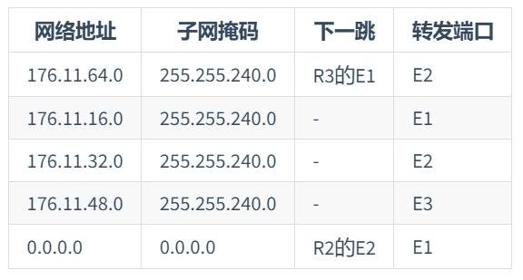

# 第2次书面作业
- 姓名：付政烨
- 学号：2113203
## 习题1（50分）
>路由器R1的路由表如下表所示。主机A的IP地址为21.13.24.78，主机B的IP地址为176.11.64.129，主机C的IP地址为176.11.34.72；主机D的IP地址为176.11.31.168，主机E的IP地址为176.11.60.239，主机F的IP地址为192.36.8.73。路由器R1接收到分别发送到目的主机（主机A~主机F）的分组。请回答以下3个问题：
>1. 根据R1的路由表信息推断并绘制出网络结构图。（22分）
>2. 如果R3的E1与R2的E2的IP地址主机号均为5，那么这两个端口的IP地址是什么？（10分）
>3. 对于目的地址为主机A~主机F的分组，它们的下一跳地址分别是什么？（18分）

    

### 问题一：根据R1的路由表信息推断并绘制出网络结构图

    

### 问题二：如果R3的E1与R2的E2的IP地址主机号均为5，那么这两个端口的IP地址是什么？

- R3的E1：`176.11.16.5`
- R2的E2：`176.11.32.5`

### 问题三：对于目的地址为主机A~主机F的分组，它们的下一跳地址分别是什么？

|主机|下一跳地址|
|--|--|
|A|176.11.16.5|
|B|176.11.32.5|
|C|176.11.34.72|
|D|176.11.31.168|
|E|176.11.60.239|
|F|176.11.16.5|

## 习题2（50分）
>网络结构如下图所示。主机A的MAC地址为00-15-C5-C1-5E-28，IP地址为10.2.128.100（私有地址）。下方框中为该主机进行Web请求的1个以太网数据帧前80B的十六进制及ASCII码内容。请回答以下4个问题：
>1. Web服务器的IP地址是什么？该主机的默认网关的MAC地址是什么？（10分）
>2. 该主机在构造上图的数据帧时，使用什么协议确定目的MAC地址？封装该协议请求报文的以太网帧的目的MAC地址是什么？（10分）
>3. 假设HTTP/1.1协议以持续的非流水线方式工作，一次请求/响应时间为RTT，rfc.html页面引用了5个JPG图像，则从发出上图中的Web请求开始到浏览器收到全部内容为止，需要经过多少个RTT？（15分）
>4. 该帧所封装的IP分组经过路由器R转发时，需修改IP分组首部中的哪些字段？（15分）

    

### 问题一：Web服务器的IP地址是什么？该主机的默认网关的MAC地址是什么？

1. **Web服务器的IP地址**：
   - 以太网帧头部的长度是14字节，包括目的MAC地址（6字节）、源MAC地址（6字节）和以太网类型/长度字段（2字节）。
   - IP数据报的头部通常是20字节（如果没有选项字段），其首部中包含了目的IP地址字段。
   - 在这个特定的例子中，从以太网帧的第一个字节开始数，前14字节是以太网帧头，接下来的16字节是IP数据报头部的其余部分，总共30字节。所以，目的IP地址位于第30字节开始的位置。
   - 给出的目的IP地址为40 aa 62 20（十六进制），转换为十进制是64.170.98.32。

2. **默认网关的MAC地址**：
   - 根据以太网帧格式，帧的前6个字节是目的MAC地址。
   - 在此案例中，提供的目的MAC地址是00-21-27-21-51-ee，这就是网络中主机的默认网关（通常是路由器）的MAC地址。

因此，Web服务器的IP地址是64.170.98.32，而该主机的默认网关的MAC地址是00-21-27-21-51-ee。

### 问题二：该主机在构造上图的数据帧时，使用什么协议确定目的MAC地址？封装该协议请求报文的以太网帧的目的MAC地址是什么？

1. **确定目的MAC地址所使用的协议**：
   - 当一个主机需要向另一个主机发送数据时，它需要知道接收主机的MAC地址。如果发送主机只知道接收主机的IP地址，它将使用ARP（Address Resolution Protocol，地址解析协议）来找出相应的MAC地址。
   - ARP工作原理是：发送主机在本地网络上广播一个ARP请求，询问哪台设备持有目标IP地址。该请求包含发送主机的IP和MAC地址，以及它正在查找的目标IP地址。

2. **封装ARP请求报文的以太网帧目的MAC地址**：
   - 当主机使用ARP请求来确定目的MAC地址时，因为它还不知道目标设备的MAC地址，所以它会在以太网帧中使用一个特殊的广播地址。这个地址是全1的MAC地址，即`FF-FF-FF-FF-FF-FF`。
   - 这意味着ARP请求被发送到本地网络上的所有设备。接收此请求的设备会检查ARP消息中的IP地址，如果它与设备的IP地址匹配，该设备就会回复它的MAC地址。

综上所述，该主机在构造数据帧时，使用ARP协议来确定目的MAC地址。封装ARP请求报文的以太网帧的目的MAC地址是`FF-FF-FF-FF-FF-FF`，这是一个特殊的广播地址，用于在本地网络中广播ARP请求。

### 问题三：假设HTTP/1.1协议以持续的非流水线方式工作，一次请求/响应时间为RTT，rfc.html页面引用了5个JPG图像，则从发出上图中的Web请求开始到浏览器收到全部内容为止，需要经过多少个RTT？

考虑到`HTTP/1.1`协议在持续的非流水线模式下的工作方式，可以这样计算所需的往返时间（RTT）数量：

- 在`HTTP/1.1`的非流水线模式中，客户端必须等待服务器响应当前请求，然后才能发送下一个请求。这意味着每次请求和响应对都需要一个完整的RTT。

- 在这个情境下，首先需要一个RTT来获取`rfc.html`页面本身。

- 之后，页面中引用了5个JPG图像。由于是非流水线模式，这意味着每个图像的请求和响应将各自需要一个RTT。

因此，计算总的RTT数量如下：

- 获取`rfc.html`页面：1个RTT
- 加载5个JPG图像：5个RTT（每个图像1个RTT）

所以，总共需要1（页面）+ 5（图像）= 6个RTT。

### 问题四：该帧所封装的 IP 分组经过路由器 R 转发时，需修改 IP 分组首部中的哪些字段?

1. **需要修改的IP分组首部字段**：
   - **源IP地址**：当一个私有IP地址（如`10.2.128.100`）的数据包通过NAT路由器时，它的源IP地址会被更改为NAT路由器的公共IP地址。在此例中，源IP地址`0a 02 80 64`（即`10.2.128.100`）被更改为`65 0c 7b 0f`（即`101.12.123.15`）。

2. **其他可能的修改**：
   - **校验和**：由于源IP地址的更改，IP首部的校验和也需要重新计算和更新，以确保数据包的完整性。
   - **端口号**（如果NAT执行端口地址转换）：在某些类型的NAT（如端口地址转换PAT）中，除了IP地址外，源端口号也可能被改变。